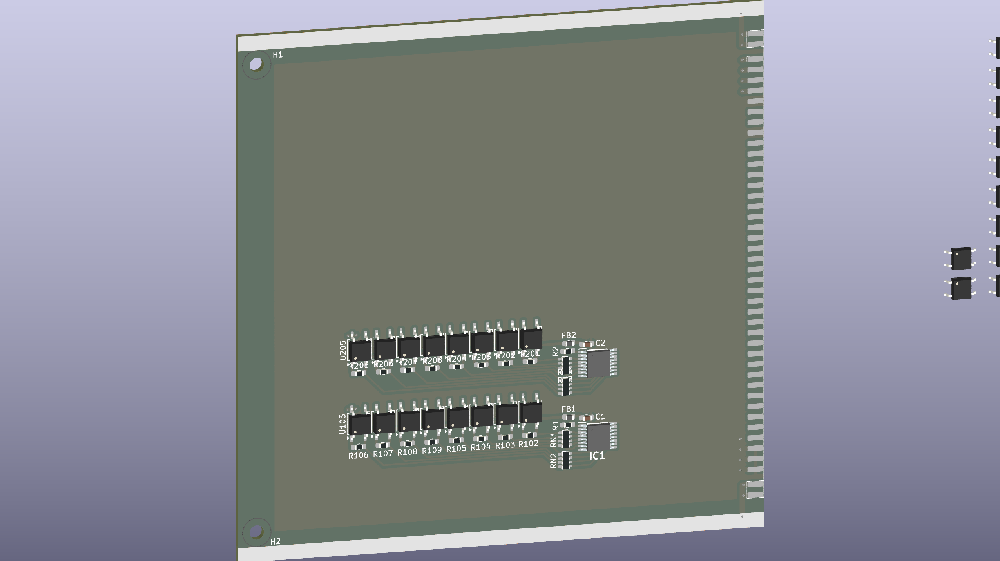

# SSM (Solidstate Switch Matrix)
Solid state relay Switch Matrix board, addon board to USB_board 

---
## Status : WIP

- Schematic and PCB is progress. 
-

---

## Features (with UCB_board):
- USB 2.0
- 10/100 Ethernet (based on WIZnet W5500)
- UART
- Half-duplex RS485 
- 3U eurocard IEEE 1101.1-1998 format (160x100 mm)

## License and Contribution

[MIT License](/LICENSE)

Open to contributions in both software and hardware!