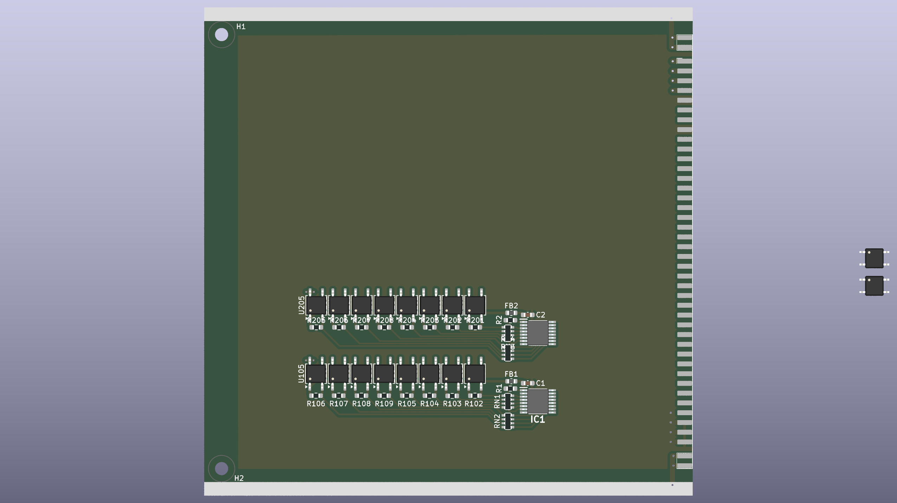
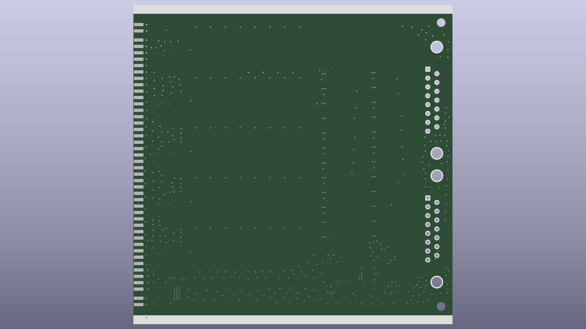

# SSM (Solidstate Switch Matrix)
Solid state relay Switch Matrix board, addon board to UCB_board 

| Top | Bottom |
|---|---|
|  |  |

---
## Status: ready for prototype order

- Schematic and PCB layout done (4-layer, 100 × 100 mm), production files generated.
- Design review completed; DRC/ERC clean (remaining items reviewed and excluded as by-design).
- Hand assembly (2 fiducials on F.Cu for stencil alignment).

Production outputs: [schematic PDF](prod/sch/SSM_board.pdf) · [PCB PDF](prod/pcb/SSM_board.pdf) · [interactive BOM](prod/ibom/SSM_board_ibom.html) · [gerbers](prod/SSM_board.zip)

---

## Features (with UCB_board):
- USB 2.0
- 10/100 Ethernet (based on WIZnet W5500)
- UART
- Half-duplex RS485 
- 3U eurocard IEEE 1101.1-1998 format (160x100 mm) — this 100 × 100 mm front module is combined with the UCB_board backend

## License and Contribution

[MIT License](/LICENSE)

Open to contributions in both software and hardware!